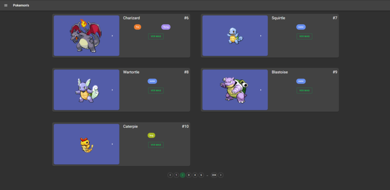
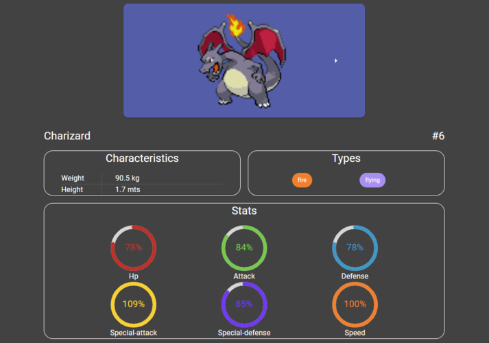
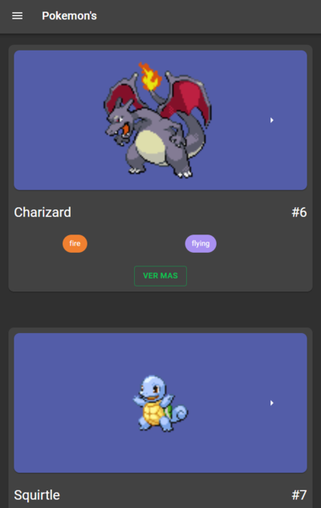
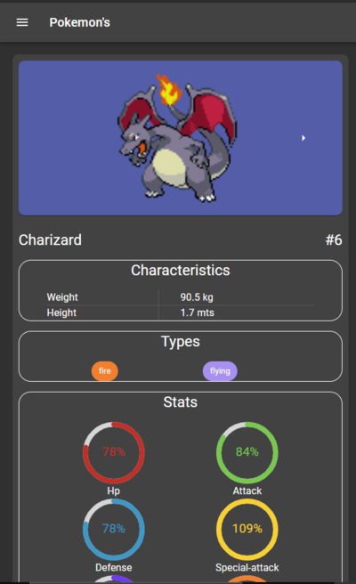

<h1 align="center">
  <a href="/">
    Pokemons
  </a>
</h1>

  <strong>Find information about your favorite pokemon's</strong> 

## Use the web

- You can use the web here 

https://pokemons-c41cc.web.app/

## Captures

  

  

  

  

## Step by step

- Environtment setup: 
 
You need to install NodeJS and NPM.  https://nodejs.org/es/download/
- Clone the repository: 
 
`git clone https://github.com/AlexisFabianCarranza/React-pokeapi.git`
- Install dependencies: 
 
`yarn`
- Run project: 
`yarn start`

## Information

- This web uses the api https://pokeapi.co/

## Main dependencies
- @material-ui | https://material-ui.com/
- jest | https://jestjs.io/
- enzyme | https://enzymejs.github.io/enzyme/
